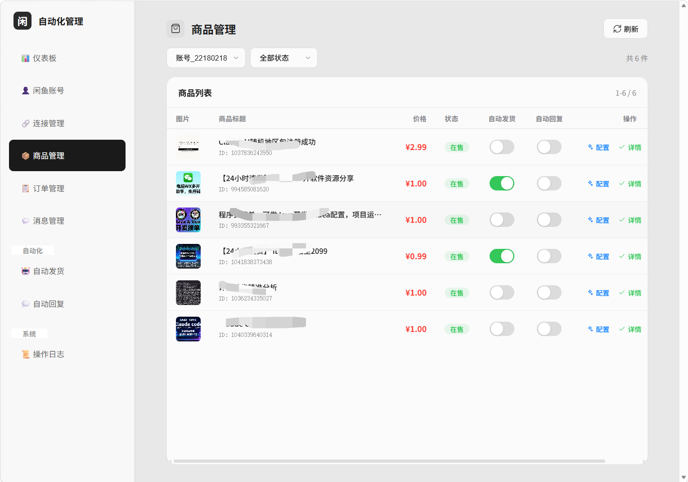
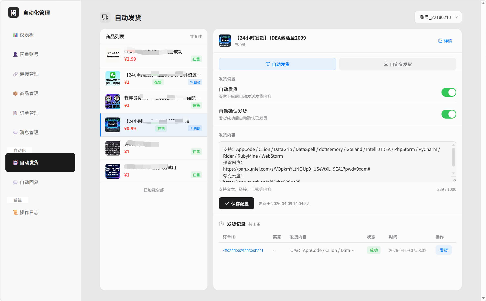
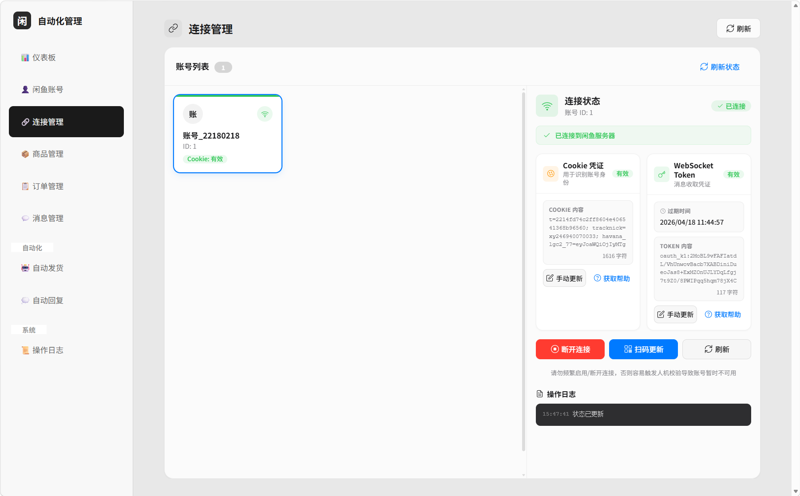

# 闲鱼自动化管理系统

<div align="center">


一个功能强大的闲鱼店铺自动化管理工具，支持自动发货、自动回复、AI智能客服、消息管理等功能。

[功能特性](#功能特性) • [部署方式](#部署方式) • [使用指南](#使用指南) • [截图展示](#截图展示) • [技术栈](#技术栈) • [API文档](#api文档) • [常见问题](#常见问题)

</div>

---

## 📸 截图展示

### 消息管理

查看聊天记录，支持快速回复和消息筛选：

<div align="center">
  
  <p><i>消息管理 - 聊天记录查看与快速回复</i></p>
</div>

### 自动发货配置

配置商品自动发货规则，支持自动确认收货：

<div align="center">
  
  <p><i>自动发货 - 自动同步闲鱼商品列表</i></p>
</div>

<div align="center">
  
  <p><i>自动发货 -  配置发货内容与规则</i></p>
</div>


### 闲鱼账号管理

管理多个闲鱼账号，支持扫码登录：

<div align="center">
  
  <p><i>账号管理 - 多账号统一管理</i></p>
</div>

### 商品管理

同步和管理闲鱼商品，配置自动化功能：

<div align="center">
  
  <p><i>商品管理 - 商品列表与配置</i></p>
</div>

---

## 📋 功能特性

### 核心功能

- 🔐 **多账号管理** - 支持同时管理多个闲鱼账号，轻松切换
- 🔗 **WebSocket连接** - 实时监听闲鱼消息，及时响应买家
- 🚀 **自动发货** - 买家付款后自动发送发货信息，节省时间
- 💬 **自动回复** - 智能匹配关键词，自动回复买家消息
- 🤖 **AI智能客服** - 集成通义千问大模型 + RAG知识库，智能回复买家
- 📦 **商品管理** - 同步商品信息，统一管理在售商品
- 📋 **订单管理** - 查看订单列表，支持一键确认发货
- 💌 **消息管理** - 查看聊天记录，支持快速回复

### 高级功能

- 🔄 **Token自动刷新** - 智能维护登录状态，随机间隔避免检测
- 📊 **数据统计** - 实时查看账号、商品、订单等数据统计
- 📜 **操作日志** - 详细记录所有操作，方便追踪和排查
- 🎯 **消息过滤** - 支持按商品、账号筛选消息
- 🔐 **滑块验证处理** - 智能检测验证需求，提供详细操作指引
- 🧠 **RAG知识库** - 按商品维度构建向量知识库，提升AI回复准确性
- 🔌 **自定义发货** - 提供API接入指南，支持外部系统对接发货流程

---

## 🚀 部署方式

### 方式一：一键安装（推荐）

适合快速体验，自动检测并安装 JDK 21，下载 JAR 包并启动服务。

#### Linux / Mac / Termux

```bash
# Gitee（国内推荐）
curl -fsSL https://gitee.com/lzy2018cn/xian-yu-assistant/raw/master/install.sh | bash

# GitHub
curl -fsSL https://raw.githubusercontent.com/IAMLZY2018/XianYuAssistant/master/install.sh | bash
```

#### 自定义配置

```bash
# 自定义端口
PORT=8080 curl -fsSL https://gitee.com/lzy2018cn/xian-yu-assistant/raw/master/install.sh | bash

# 自定义 JVM 内存
JAVA_OPTS="-Xms512m -Xmx1024m" curl -fsSL https://gitee.com/lzy2018cn/xian-yu-assistant/raw/master/install.sh | bash
```

#### 安装流程

```
1. 检查 JDK 环境 → 未安装则提示安装 JDK 21
2. 选择下载源 → Gitee 或 GitHub
3. 下载 JAR 包 → 自动下载最新版本
4. 启动服务 → 后台运行并输出访问地址
```

#### 支持的操作系统

| 系统 | 安装命令 |
|------|----------|
| Ubuntu/Debian | `apt-get install openjdk-21-jdk` |
| CentOS/RHEL/Rocky | `yum install java-21-openjdk` |
| Fedora | `dnf install java-21-openjdk` |
| macOS | `brew install openjdk@21` |
| Arch/Manjaro | `pacman -S jdk-openjdk` |
| Termux (Android) | `pkg install openjdk-21` |

---

### 方式二：JAR包部署

适合快速体验和生产环境使用，无需安装开发环境。

#### 环境要求

- **Java**: 21 或更高版本

#### 部署步骤

1. **下载JAR包**

   前往 [Releases](https://github.com/IAMLZY2018/XianYuAssistant/releases) 页面下载最新版本的 `xianyu-assistant.jar`

2. **启动应用**

   ```bash
   java -jar xianyu-assistant.jar
   ```

3. **访问应用**

   打开浏览器访问: `http://localhost:12400`

#### 后台运行（可选）

**Windows:**
```bash
start /b java -jar xianyu-assistant.jar
```

**Linux/Mac:**
```bash
nohup java -jar xianyu-assistant.jar &
```

---

### 方式二：Docker部署

适合容器化部署和服务器环境，自动完成所有构建步骤。

#### 环境要求

- **Docker**: 20.10+
- **Docker Compose**: 2.0+ (可选)

#### 本地Docker部署

1. **克隆项目**

   ```bash
   # Gitee (国内推荐)
   git clone https://gitee.com/lzy2018cn/xian-yu-assistant.git

   # 或 GitHub
   git clone https://github.com/IAMLZY2018/-XianYuAssistant.git

   cd xian-yu-assistant
   ```

2. **启动服务**

   ```bash
   docker-compose up -d
   ```

3. **查看日志**

   ```bash
   docker-compose logs -f
   ```

4. **访问应用**

   打开浏览器访问: `http://localhost:12400`

#### 服务器Docker部署

1. **SSH连接到服务器**

   ```bash
   ssh username@your-server-ip
   ```

2. **安装Docker（如未安装）**

   ```bash
   curl -fsSL https://get.docker.com | sh
   sudo systemctl start docker
   sudo systemctl enable docker
   ```

3. **克隆并启动**

   ```bash
   cd /opt

   # Gitee (国内推荐)
   git clone https://gitee.com/lzy2018cn/xian-yu-assistant.git

   # 或 GitHub
   git clone https://github.com/IAMLZY2018/-XianYuAssistant.git

   cd xian-yu-assistant
   docker compose up -d
   ```

4. **访问应用**

   打开浏览器访问: `http://your-server-ip:12400`

#### Docker常用命令

```bash
# 停止服务
docker-compose down

# 重启服务
docker-compose restart

# 查看日志
docker-compose logs -f

# 更新服务
git pull
docker-compose up -d --build
```

#### 更多Docker部署信息

- [完整Docker部署指南](DOCKER_DEPLOY.md) - 详细的Docker配置和故障排查
- [服务器部署指南](SERVER_DEPLOY.md) - 生产环境部署、Nginx配置、HTTPS等

---

## 📖 使用指南

### 快速上手

#### 1️⃣ 添加闲鱼账号

- 进入"闲鱼账号"页面
- 点击"扫码登录"按钮
- 使用闲鱼APP扫描二维码
- 等待登录成功

#### 2️⃣ 启动WebSocket连接

- 进入"连接管理"页面
- 选择要连接的账号
- 点击"启动连接"按钮
- 等待连接成功

> ⚠️ **注意**: 如果遇到滑块验证，请按照弹窗提示操作：
> 1. 访问闲鱼IM页面完成验证
> 2. 点击"❓ 如何获取？"按钮查看教程
> 3. 手动更新Cookie和Token

#### 3️⃣ 同步商品信息

- 进入"商品管理"页面
- 选择已连接的账号
- 点击"刷新商品"按钮
- 等待商品同步完成

#### 4️⃣ 配置自动化功能

- 在商品列表中找到目标商品
- 开启"自动发货"或"自动回复"
- 配置发货内容或回复规则
- 保存配置，自动化开始工作

### 功能说明

#### 自动发货

当买家付款后，系统会自动检测到"已付款待发货"消息，并根据配置自动发送发货信息。

**配置步骤**:
1. 进入"自动发货"页面
2. 选择商品
3. 切换到"自动发货"标签页
4. 开启自动发货开关
5. 输入发货内容（支持文本、链接、卡密等）
6. 可选：开启"自动确认发货"
7. 保存配置

#### 自定义发货

支持通过API接口对接外部系统实现自定义发货逻辑。

**使用步骤**:
1. 进入"自动发货"页面
2. 选择商品
3. 切换到"自定义发货"标签页
4. 查看API接入指南，包含接口地址、请求参数、参数说明
5. 点击"复制"按钮获取接口和参数信息
6. 在外部系统中调用API完成发货

#### 自动回复

智能匹配买家消息中的关键词，自动发送预设的回复内容。

**配置步骤**:
1. 进入"自动回复"页面
2. 选择商品，点击"添加规则"
3. 设置关键词和回复内容
4. 选择匹配方式（精确/模糊/正则）
5. 保存规则

#### AI智能客服

集成通义千问大模型，通过RAG知识库实现智能回复。

**配置步骤**:
1. 配置环境变量 `ALI_API_KEY`（阿里云API Key）
2. 部署Chroma向量数据库
3. 在AI对话页面上传商品知识库数据
4. 开启AI自动回复

#### Token刷新策略

系统采用随机间隔刷新策略，避免被检测为机器人：

- **Cookie保活**: 每30分钟调用hasLogin接口
- **_m_h5_tk**: 1.5-2.5小时随机刷新
- **websocket_token**: 10-14小时随机刷新
- **账号间隔**: 2-5秒随机

---

## 🛠️ 技术栈

### 后端

| 技术 | 版本 | 用途 |
|------|------|------|
| Java | 21 | 编程语言 |
| Spring Boot | 3.5.7 | 应用框架 |
| MyBatis-Plus | 3.5.5 | ORM框架 |
| SQLite | 3.42.0 | 嵌入式数据库 |
| Java-WebSocket | 1.5.4 | WebSocket客户端 |
| OkHttp | 4.12.0 | HTTP客户端 |
| Gson | 2.10.1 | JSON处理 |
| MessagePack | 0.9.8 | 消息解密 |
| Playwright | 1.40.0 | 浏览器自动化(扫码登录) |
| ZXing | 3.5.3 | 二维码生成 |
| Spring AI | 1.1.4 | AI集成(通义千问+RAG) |
| Lombok | - | 简化代码 |

### 前端

| 技术 | 版本 | 用途 |
|------|------|------|
| Vue | 3.5 | 渐进式框架 |
| TypeScript | 5.x | 类型安全 |
| Element Plus | 2.11 | UI组件库 |
| Vite | 7.x | 构建工具 |
| Axios | 1.13 | HTTP客户端 |
| Pinia | 3.0 | 状态管理 |
| Vue Router | 4.6 | 路由管理 |

---

## 📁 项目结构

```
xianyu-assistant/
├── src/main/java/                          # Java源代码
│   └── com/feijimiao/xianyuassistant/
│       ├── controller/                      # 控制器层 (11个Controller)
│       │   ├── dto/                         # 请求DTO
│       │   └── vo/                          # 响应VO
│       ├── service/                         # 服务层 (17个Service)
│       │   └── impl/                        # 服务实现
│       ├── mapper/                          # 数据访问层 (11个Mapper)
│       ├── entity/                          # 实体类 (11个Entity)
│       ├── config/                          # 配置类
│       │   └── rag/                         # AI/RAG配置
│       ├── websocket/                       # WebSocket核心
│       │   └── handler/                     # 消息处理器
│       ├── event/                           # Spring事件机制
│       │   └── chatMessageEvent/            # 聊天消息事件及监听器
│       ├── exception/                       # 异常处理
│       ├── enums/                           # 枚举类
│       ├── constants/                       # 常量定义
│       └── utils/                           # 工具类 (11个Utils)
├── src/main/resources/
│   ├── static/                              # 前端构建产物
│   ├── sql/schema.sql                       # 数据库建表脚本
│   └── application.yaml                     # 配置文件
├── vue-code/                                # 前端源代码
│   ├── src/
│   │   ├── views/                           # 页面组件 (10个页面)
│   │   ├── components/                      # 公共组件
│   │   ├── api/                             # API接口 (10个模块)
│   │   ├── stores/                          # Pinia状态管理
│   │   ├── router/                          # 路由配置
│   │   ├── types/                           # TypeScript类型定义
│   │   └── utils/                           # 工具函数
│   └── vite.config.ts                       # Vite构建配置
├── dbdata/                                  # SQLite数据库文件
├── logs/                                    # 日志文件
├── docs/                                    # 文档及截图
├── pom.xml                                  # Maven构建配置
├── docker-compose.yml                       # Docker Compose配置
├── Dockerfile                               # Docker多阶段构建
└── build-all.bat                            # 一键构建脚本
```

---

## 📊 数据库设计

使用SQLite嵌入式数据库，数据文件位于 `dbdata/xianyu_assistant.db`。

| 表名 | 说明 |
|------|------|
| `xianyu_account` | 闲鱼账号信息 |
| `xianyu_cookie` | Cookie/Token凭证 |
| `xianyu_goods` | 商品信息 |
| `xianyu_chat_message` | 聊天消息记录 |
| `xianyu_goods_config` | 商品配置（自动发货/回复开关） |
| `xianyu_goods_auto_delivery_config` | 自动发货配置 |
| `xianyu_goods_auto_delivery_record` | 自动发货记录 |
| `xianyu_goods_auto_reply_config` | 自动回复配置 |
| `xianyu_goods_auto_reply_record` | 自动回复记录 |
| `xianyu_order` | 订单信息 |
| `xianyu_operation_log` | 操作日志 |

---

## 🔌 API文档

所有API以 `/api` 为前缀，采用 POST + JSON 请求体风格。

### 账号管理

| 接口 | 说明 |
|------|------|
| `POST /api/account/list` | 获取账号列表 |
| `POST /api/account/add` | 添加账号 |
| `POST /api/account/update` | 更新账号 |
| `POST /api/account/delete` | 删除账号 |
| `POST /api/account/detail` | 获取账号详情 |

### WebSocket管理

| 接口 | 说明 |
|------|------|
| `POST /api/websocket/start` | 启动WebSocket连接 |
| `POST /api/websocket/stop` | 停止WebSocket连接 |
| `POST /api/websocket/status` | 获取连接状态 |
| `POST /api/websocket/sendMessage` | 发送消息 |
| `POST /api/websocket/refreshToken` | 刷新Token |

### 商品管理

| 接口 | 说明 |
|------|------|
| `POST /api/item/list` | 获取商品列表 |
| `POST /api/item/refresh` | 刷新商品信息 |

### 订单管理

| 接口 | 说明 |
|------|------|
| `POST /api/order/list` | 获取订单列表 |
| `POST /api/order/confirmShipment` | 确认发货 |

#### 订单列表参数

| 参数 | 类型 | 必填 | 说明 |
|------|------|------|------|
| xianyuAccountId | number | 否 | 闲鱼账号ID |
| xyGoodsId | string | 否 | 闲鱼商品ID |
| orderStatus | number | 否 | 1=待付款 2=待发货 3=已发货 4=已完成 5=已关闭 |
| pageNum | number | 是 | 页码 |
| pageSize | number | 是 | 每页条数 |

#### 确认发货参数

| 参数 | 类型 | 必填 | 说明 |
|------|------|------|------|
| xianyuAccountId | number | 是 | 闲鱼账号ID |
| orderId | string | 是 | 订单ID |

### 自动发货

| 接口 | 说明 |
|------|------|
| `POST /api/auto-delivery-config/get` | 获取自动发货配置 |
| `POST /api/auto-delivery-config/saveOrUpdate` | 保存/更新配置 |
| `POST /api/auto-delivery-record/list` | 获取发货记录 |
| `POST /api/auto-delivery-record/confirmShipment` | 确认已发货 |
| `POST /api/auto-delivery-record/triggerAutoDelivery` | 触发自动发货 |

### 自动回复

| 接口 | 说明 |
|------|------|
| `POST /api/auto-reply-config/list` | 获取回复规则列表 |
| `POST /api/auto-reply-config/saveOrUpdate` | 保存/更新规则 |
| `POST /api/auto-reply-config/delete` | 删除规则 |
| `POST /api/auto-reply-record/list` | 获取回复记录 |

### 消息管理

| 接口 | 说明 |
|------|------|
| `POST /api/msg/list` | 获取消息列表 |
| `POST /api/msg/send` | 发送消息 |

### AI智能客服

| 接口 | 说明 |
|------|------|
| `POST /ai/chat` | AI对话（SSE流式响应） |
| `POST /ai/putNewData` | 写入RAG知识库数据 |

### 其他

| 接口 | 说明 |
|------|------|
| `POST /api/dashboard/stats` | 仪表板数据统计 |
| `POST /api/operation-log/list` | 操作日志列表 |
| `POST /api/qrlogin/generate` | 生成登录二维码 |
| `POST /api/qrlogin/check` | 检查扫码状态 |

---

## 🏗️ 架构设计

### WebSocket消息处理流程

```
闲鱼服务器 → XianyuWebSocketClient(接收+解密+ACK)
  → DefaultWebSocketMessageHandler(分发)
    → WebSocketMessageRouter(按lwp字段路由)
      → SyncMessageHandler(解析消息字段)
        → ApplicationEventPublisher(发布ChatMessageReceivedEvent)
          → [异步] ChatMessageEventSaveListener(去重+保存DB)
          → [异步] ChatMessageEventAutoDeliveryListener(判断+自动发货)
```

### 凭证体系

三级凭证依赖关系：Cookie → _m_h5_tk → WebSocket Token

- **Cookie**: 登录态基础，每30分钟保活
- **_m_h5_tk**: API签名令牌，每2小时刷新
- **WebSocket Token**: 连接鉴权令牌，提前1小时刷新

详细说明见 [CREDENTIALS.md](CREDENTIALS.md)

### 设计特点

- **事件驱动**: 消息解析与业务处理解耦，通过Spring Event机制异步并发执行
- **模板方法模式**: AbstractLwpHandler定义处理骨架，SyncMessageHandler实现具体逻辑
- **信号量控制**: 最多100个并发消息处理
- **人工模拟**: HumanLikeDelayUtils模拟阅读/思考/打字延迟，避免风控检测
- **嵌入式数据库**: SQLite零外部依赖，数据文件随应用管理

---

## 📝 开发指南

### 从源码构建

#### 环境要求

- **Java**: 21 或更高版本
- **Node.js**: 20.19.0 或更高版本
- **Maven**: 3.6+ (可选，项目包含 Maven Wrapper)

#### 构建步骤

1. **克隆项目**

   ```bash
   # Gitee (国内推荐)
   git clone https://gitee.com/lzy2018cn/xian-yu-assistant.git

   # 或 GitHub
   git clone https://github.com/IAMLZY2018/-XianYuAssistant.git

   cd xian-yu-assistant
   ```

2. **构建前端**

   ```bash
   cd vue-code
   npm install
   npm run build:spring
   cd ..
   ```

3. **启动后端**

   ```bash
   # Windows
   mvnw.cmd spring-boot:run

   # Linux/Mac
   ./mvnw spring-boot:run
   ```

4. **访问应用**

   打开浏览器访问: `http://localhost:12400`

### 前端开发模式

```bash
cd vue-code
npm install
npm run dev
```

访问: `http://localhost:5173`，Vite自动将 `/api` 请求代理到后端 `http://localhost:12400`。

### 构建生产版本

```bash
# 方式一：一键构建
build-all.bat

# 方式二：分步构建
cd vue-code && npm run build:spring && cd ..
mvn clean package
```

生成的JAR包位于: `target/xianyu-assistant.jar`

### AI功能配置

如需启用AI智能客服功能：

1. 设置环境变量 `ALI_API_KEY`（阿里云DashScope API Key）
2. 部署Chroma向量数据库（默认连接 `http://192.168.8.88:8321`）
3. 在 `application.yaml` 中配置AI模型参数

---

## ❓ 常见问题

### 1. WebSocket连接失败怎么办？

**解决方案**:
1. 检查Cookie是否有效
2. 尝试手动更新Token
3. 如果提示需要滑块验证，访问 https://www.goofish.com/im 完成验证后手动更新Cookie和Token

### 2. 如何获取Cookie和Token？

点击连接管理页面中Cookie和Token区域的"❓ 如何获取？"按钮，查看详细的图文教程。

### 3. 自动发货什么时候触发？

当买家付款后，系统会自动检测到"已付款待发货"消息，并根据配置自动发送发货信息。

### 4. Token过期了怎么办？

系统会自动刷新Token（1.5-2.5小时刷新一次），也可以在连接管理页面手动更新。

### 5. 为什么不建议频繁启动/断开连接？

频繁操作容易触发闲鱼的人机验证，导致账号暂时不可用。建议保持连接稳定。

### 6. 如何使用自定义发货？

切换到"自定义发货"标签页，查看API接入指南，复制接口地址和请求参数，在外部系统中调用 `/api/order/list` 获取待发货订单，再调用 `/api/order/confirmShipment` 确认发货。

### 7. AI智能客服如何配置？

1. 获取阿里云API Key并设置环境变量 `ALI_API_KEY`
2. 部署Chroma向量数据库
3. 在AI对话页面上传商品知识库数据
4. 系统将自动使用RAG检索相关知识并生成智能回复

---

## 🤝 贡献指南

感谢Python版本提供的参考：

https://github.com/zhinianboke/xianyu-auto-reply

欢迎提交Issue和Pull Request！

**仓库地址:**

- 🇨🇳 Gitee: https://gitee.com/lzy2018cn/xian-yu-assistant
- 🌍 GitHub: https://github.com/IAMLZY2018/-XianYuAssistant

**贡献步骤:**

1. Fork本项目
2. 创建特性分支 (`git checkout -b feature/AmazingFeature`)
3. 提交更改 (`git commit -m 'Add some AmazingFeature'`)
4. 推送到分支 (`git push origin feature/AmazingFeature`)
5. 提交Pull Request

---

## 📄 许可证

本项目采用 Apache License 2.0 许可证 - 查看 [LICENSE](LICENSE) 文件了解详情

---

## ⚠️ 免责声明

本项目仅供学习交流使用，请勿用于商业用途。使用本工具产生的任何后果由使用者自行承担。

---

## 📧 联系方式

如有问题或建议，欢迎通过以下方式联系：

- 提交 [Issue](https://github.com/IAMLZY2018/-XianYuAssistant/issues)
- **联系作者:** https://www.feijimiao.cn/contact

---

<div align="center">

**如果这个项目对你有帮助，请给个 ⭐️ Star 支持一下！**

Made with ❤️

</div>
